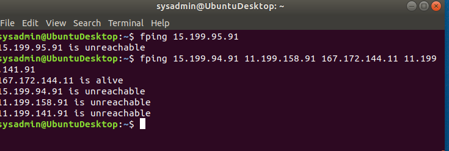
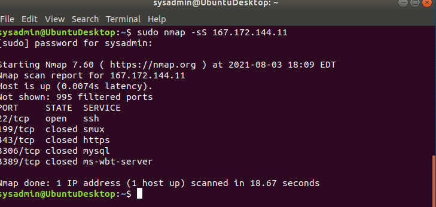
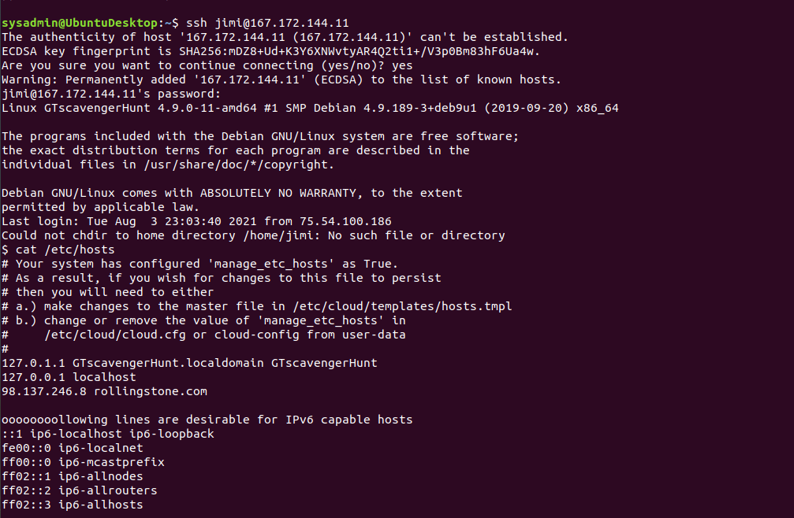
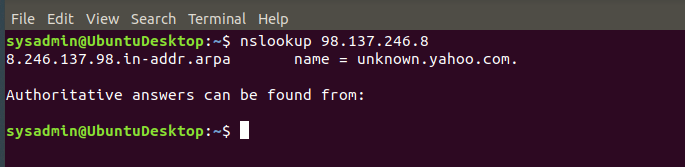
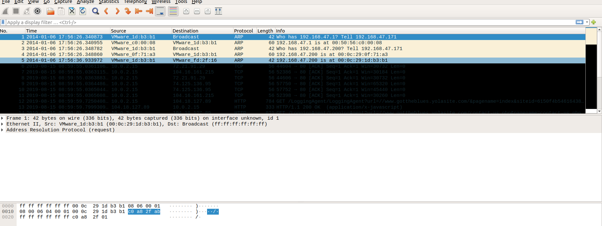

### step one "I'd like to Teach the World to Ping"

List the steps and commands used to complete the tasks.
- *fping  167.172.144.11* 

List any vulnerabilities discovered.
- *i discovered that IP adress 167.172.144.11 is a life*

List any findings associated to a hacker.
four ip adresses are shows unreachable but there is only one ip adress that shows alive ip adress
- *167.172.144.11 is alive*
- *15.199.94.91 is unreachable*
- *11.199.158.91 is unreachable*
- *11.199.141.91 is unreachable*
- *15.199.95.91 is unreachable*
I ran nping against the four ip addresses hosted in Hollywood, only one of which (167.172.144.11) shows alive. this is the network layer. This could be the result of a hacker having a access to one of Rockstar Corp's servers and having opened a port. i recomended to closed that port before the hacker gaines more information from the rockstar corp's.
- *This occurred on the network layer*

- **

### Phase 2:  "Some Syn for Nothin`"

ou will run a SYN SCAN against the IP accepting connections. See SYN SCAN Instructions below.
- *sudo nmap -sS 167.172.144.11*
Using the results of the SYN SCAN, determine which ports are accepting connections.
- *port 22/tcp is open*
Add these findings to the summary and be sure to indicate at which OSI layer your findings were found
we can see that an ssh port is open, also number of remote access service ports. the hacker is using the trasport layer for spidering TCP, UDP, 
- *port 22\tcp is part of the transport layer* 

- **

### Phase 3: "I Feel a DNS Change Comin' On"

first i remote log in to their computer using the user and passowrd i was giving
- *ssh jimi@167.172.144.11 yes password hendrix*
then i used this commend to find out about what rockStar Corp recently reported, and why that they are unable to access rollingstone.com 
- *cat /etc/hosts*
then i exit there server and u use this command:
- *exit*
after that i use my lookup command to find out the domain associated to an IP address
- *nslookup 98.137.246.8*
 this hacker has the server and modified the /etc/hosts file to point traffic to another domain.  This can be confirmed using nslookup.
- *OSI Layer - Application Layer*

- **

- **

### Phase 4:  "ShARP Dressed Man"

Within the RockStar server that you SSH'd into, and in the same directory as the configuration file from Phase 3, the hacker left a note as to where he stored away some packet captures.
- *ssh jimi:167.172.144.11 password hendrix*
then i use this command to list all the directories and files inside etc
- *ls /etc/*
then in order to View the file to find where to recover the packet captures.
then i use this command 
- *cat /etc/packetcaptureinfo.txt*
packetcapture :
Captured Packets are here:
https://drive.google.com/file/d/1ic-CFFGrbruloYrWaw3PvT71elTkh3eF/view?usp=sharing

- **                                     - **

fromhere i find out about this the hacker on port 4606 open and port 80 open. POST /formservice/ and has two different mac addresses. my result of the hacker redirecting network traffic or backdooring into RockStar Corp's server, set in the server's /etc/hosts
Hacker has MAC address of Frame 1: 42 bytes on wire (336 bits), 42 bytes captured (336 bits) on interface unknown, id 1
this hacker is using OSI layer the hacker too advantage of is the network layer.

- *This occurred on the network layer*

some of my findings are here. 
Ethernet II, Src: VMware_1d:b3:b1 (00:0c:29:1d:b3:b1), Dst: Broadcast (ff:ff:ff:ff:ff:ff)
    Destination: Broadcast (ff:ff:ff:ff:ff:ff)
    Source: VMware_1d:b3:b1 (00:0c:29:1d:b3:b1)
    Type: ARP (0x0806)
Address Resolution Protocol (request
    Hardware type: Ethernet (1)
    Protocol type: IPv4 (0x0800)
    Hardware size: 6
    Protocol size: 4
    Opcode: request (1)
    Sender MAC address: VMware_1d:b3:b1 (00:0c:29:1d:b3:b1)
    Sender IP address: 192.168.47.171 (192.168.47.171)
    Target MAC address: Broadcast (ff:ff:ff:ff:ff:ff)
    Target IP address: 192.168.47.1 (192.168.47 

